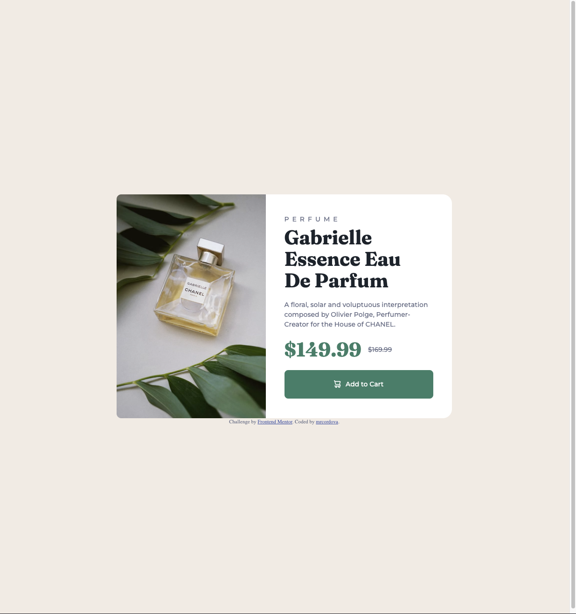

# Frontend Mentor - Product preview card component solution

This is a solution to the [Product preview card component challenge on Frontend Mentor](https://www.frontendmentor.io/challenges/product-preview-card-component-GO7UmttRfa). Frontend Mentor challenges help you improve your coding skills by building realistic projects.

## Table of contents

- [Overview](#overview)
  - [The challenge](#the-challenge)
  - [Screenshot](#screenshot)
  - [Links](#links)
- [My process](#my-process)
  - [Built with](#built-with)
  - [What I learned](#what-i-learned)
  - [Continued development](#continued-development)
  - [Useful resources](#useful-resources)
- [Author](#author)

## Overview

### The challenge

Users should be able to:

- View the optimal layout depending on their device's screen size
- See hover and focus states for interactive elements

### Screenshot

### Links

- Solution URL: [Github Repo](https://github.com/mrcordova/product-preview-card-component)
- Live Site URL: [Github Page](https://mrcordova.github.io/product-preview-card-component/)

## My process

### Built with

- Semantic HTML5 markup
- CSS custom properties
- Flexbox
- CSS Grid
- CSS Clamp

### What I learned

I learned about dynamic fonts by using the CSS clamp function for responsive font changes.

### Continued development

I would like to keep learning about responsive layouts.

### Useful resources

- [Semantic appropriate tag](https://stackoverflow.com/questions/9632311/which-html-tags-are-more-appropriate-for-money) - I used this to tag the prices in the preview card.
- [Remove button styling](https://stackoverflow.com/questions/2460100/remove-the-complete-styling-of-an-html-button-submit) - I learned how to remove all styling from buttons to have semantic value but giving more continue.
- [Dynamtic font](https://web.dev/learn/design/typography) - This is an amazing article which helped me finally understand how to make dynamic fonts.

## Author

- Website - [mrcordova](https://github.com/mrcordova)
- Frontend Mentor - [@mrcordova](https://www.frontendmentor.io/profile/mrcordova)
